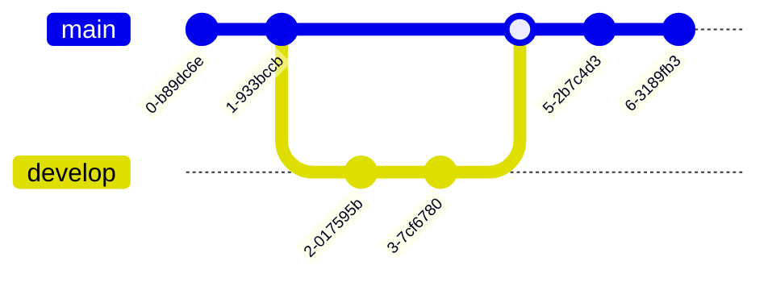

<article class="message is-info"><div class="message-body">
[Source](https://hexo.fluid-dev.com/docs/guide/)
This is a page that showcases all the syntax that are supported by fluid and hexo.
</div></article>

# Index image in home page

```markdown
---
title: 文章标题
tags: [Hexo, Fluid]
index_img: /img/example.jpg
date: 2019-10-10 10:00:00
---

以下是文章内容
```
<!--more-->

# Codeblocks

```python
import numpy as np
import pandas as pd
import matplotlib.pyplot as plt
```

# Latex formulas

$$
E=mc^2
$$

# Mermaid diagrams [^1]

[^1]: Links: [Source](https://mermaid-js.github.io/mermaid/#/); [Github](https://github.com/mermaid-js/mermaid)

## Gannt diagram

## classDiagram


[^2]: This is the footnote content
[^3]: This is the footnote content

## Graph


## Sequence diagram


## Git graph



## Flowchart


# Using footnotes

This is a sentence[^2]

This is a sentence[^2][^3]

This is a sentence[^2]

This is a sentence[^2]
